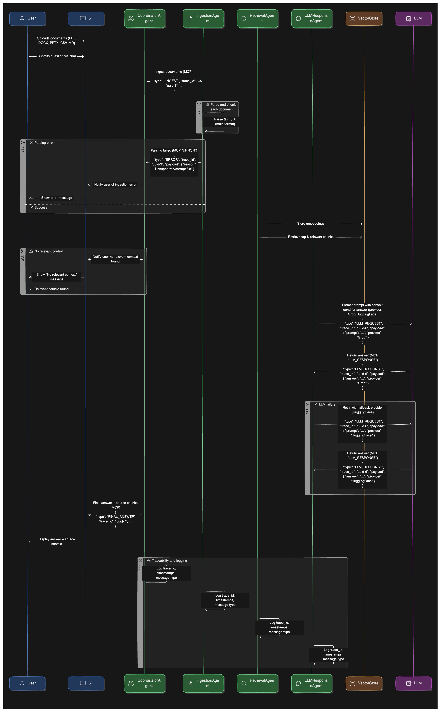
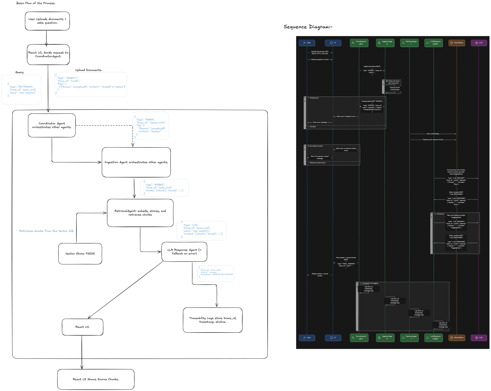

# Agentic RAG Chatbot with FastAPI, React, and MCP

This project implements a high-performance, enterprise-grade Retrieval-Augmented Generation (RAG) chatbot. It features a decoupled architecture with a **React (Vite + TypeScript)** frontend and a **FastAPI (Python)** backend.

The backend is built as a set of microservices, where each agent (`Ingestion`, `Retrieval`, `LLMResponse`) operates as a distinct API endpoint. A central **Coordinator** agent orchestrates the workflow by making HTTP requests to these services, perfectly embodying the principles of a distributed, message-passing system as outlined by the Model Context Protocol (MCP).

**Please Check the Exaclidraw file for the Execution Flow.**

**Screenshots:**

<p align="center">
  
  &nbsp;
  
  
  &nbsp;
  
  &nbsp;
  
</p>

---

## Table of Contents

- [Features](#-features)
- [System Architecture](#-system-architecture)
  - [Frontend](#frontend)
  - [Backend](#backend)
  - [Model Context Protocol (MCP) via REST](#model-context-protocol-mcp-via-rest)
- [Advanced RAG Techniques](#-advanced-rag-techniques)
- [System Workflow](#-system-workflow)
- [Technology Stack](#-technology-stack)
- [Setup and Installation](#-setup-and-installation)
- [Project Structure](#-project-structure)

---

## Features

- **Decoupled Frontend/Backend:** A modern React SPA communicates with a powerful Python backend for a robust and scalable user experience.
- **Microservice-based Agents:** Each agent is an independent FastAPI endpoint, allowing for isolated logic and potential for independent scaling.
- **RESTful MCP:** Agent communication is handled via asynchronous HTTP requests, a real-world implementation of message passing.
- **Session-based & Stateful:** Manages a unique session for each file upload, storing its vectorized context in memory for the duration of the session.
- **Two-Stage Advanced Retrieval:** Implements a sophisticated retrieval strategy using a fast initial search with FAISS, followed by a more accurate **Cross-Encoder re-ranking** to significantly improve context quality.
- **Conversational Query Rewriting:** Understands chat history and rewrites follow-up questions into standalone queries for better retrieval accuracy.
- **Precise Source Citing:** After generating an answer, a final LLM call is made to extract the supporting snippet from the source text, providing highly accurate citations.

---

## System Architecture

The system is designed with a clean separation between the client-side user interface and the server-side logic, communicating over a REST API.




### Frontend

- A **React** single-page application built with **Vite** and **TypeScript**.
- Manages all UI components, user interactions, and application state (`session_id`, chat history).
- Communicates with the backend by making API calls to the Coordinator agent's endpoints.
- Uses **TailwindCSS** and **shadcn/ui** for a polished, modern design.

### Backend

- A **FastAPI** application serving the agentic logic.
- **`main.py`** acts as the server entry point, mounting each agent's router and handling CORS.
- **Agents as API Endpoints:**
  - **Coordinator (`/agent/coordinator`)**: The only agent the frontend interacts with. It orchestrates the entire RAG pipeline by calling other agents.
  - **Ingestion (`/agent/ingestion`)**: An internal endpoint that receives file data, parses it, and chunks the text.
  - **Retrieval (`/agent/retrieval`)**: An internal endpoint that takes a query, re-ranks retrieved chunks, and returns the best context.
  - **LLMResponse (`/agent/llm`)**: An internal endpoint that receives context and a query to generate the final answer.
- **In-Memory State:** A global dictionary (`session_vector_stores`) holds the FAISS vector store for each active user session.

### Model Context Protocol (MCP) via REST

This project uses HTTP as the transport layer for MCP. The **Coordinator Agent** acts as a client that sends requests (messages) to the other agent servers. Each request/response cycle constitutes message passing.

- **Sender/Receiver:** Defined by which service is calling which endpoint.
- **Traceability:** A `trace_id` is generated for each session and logged with every major action on the backend, providing clear, traceable execution paths.
- **Payload:** The body of the HTTP requests and responses contains the message payload.

---

## Advanced RAG Techniques

This chatbot goes beyond a basic RAG implementation:

1.  **Query Rewriting:** The `RetrievalAgent` analyzes the chat history to transform ambiguous follow-up questions (e.g., "why?") into specific, standalone queries (e.g., "why was the Q3 revenue lower than Q2?").
2.  **Re-Ranking with Cross-Encoders:** Instead of just trusting the initial vector search, the `RetrievalAgent` retrieves a larger set of initial candidates (k=10) and then uses a `CrossEncoder` model (`ms-marco-MiniLM-L-6-v2`) to deeply evaluate the relevance of each candidate to the query. This significantly enhances the quality of the context sent to the LLM.
3.  **Answer-Based Snippet Extraction:** After the final answer is generated, the `Coordinator` performs one last step: it asks the LLM to find the precise sentence or phrase within the source paragraphs that best supports the generated answer. This gives the user extremely relevant and verifiable sources.

---

## System Workflow

1.  **Start Session:**
    - The React frontend `POST`s the uploaded file to `/agent/coordinator/start_session`.
    - The Coordinator creates a `session_id` and `trace_id`.
    - It makes an internal `POST` request to `/agent/ingestion/parse` with the file data.
    - The Ingestion agent returns text chunks.
    - The Coordinator creates a `VectorStore` instance, adds the chunks, and stores it in the global `session_vector_stores` dictionary against the `session_id`.
    - The `session_id` is returned to the frontend.
2.  **Query:**
    - The React frontend `POST`s the user query, chat history, and `session_id` to `/agent/coordinator/query`.
    - The Coordinator makes an internal `POST` to `/agent/retrieval/retrieve`.
    - The Retrieval agent rewrites the query, performs the 2-stage retrieval/re-ranking, and returns the top 3 context chunks.
    - The Coordinator makes an internal `POST` to `/agent/llm/respond` with the query and re-ranked chunks.
    - The LLMResponse agent generates the final answer and returns it.
    - The Coordinator runs the final `extract_precise_snippet` task.
    - The final answer and precise source snippets are returned to the frontend for display.

---

## Technology Stack

| Area             | Technology                                                    |
| :--------------- | :------------------------------------------------------------ |
| **Frontend**     | React, Vite, TypeScript, TailwindCSS, shadcn/ui               |
| **Backend**      | FastAPI, Uvicorn, Python                                      |
| **LLM API**      | Groq (Llama3 70B)                                             |
| **Embeddings**   | SentenceTransformers (`all-MiniLM-L6-v2`)                     |
| **Re-Ranking**   | SentenceTransformers (`cross-encoder/ms-marco-MiniLM-L-6-v2`) |
| **Vector Store** | FAISS (in-memory)                                             |
| **Doc Parsing**  | PyMuPDF, python-docx, python-pptx, pandas                     |

---

## Setup and Installation

This project has two parts: a backend and a frontend. Both must be running concurrently.

### Backend Setup

1.  **Navigate to the backend directory:**
    ```bash
    cd backend
    ```
2.  **Create and activate a virtual environment:**
    ```bash
    python3 -m venv venv
    source venv/bin/activate
    ```
3.  **Install Python dependencies:**
    ```bash
    pip install -r requirements.txt
    ```
4.  **Create a `.env` file** in the `backend` directory and add your Groq API key:
    ```env
    GROQ_API_KEY="YOUR_GROQ_API_KEY_HERE"
    ```
5.  **Run the FastAPI server:**
    ```bash
    uvicorn main:app --reload
    ```
    The backend will be running at `http://localhost:8000`.

### Frontend Setup

1.  **Open a new terminal** and navigate to the frontend directory:
    ```bash
    cd frontend
    ```
2.  **Install Node.js dependencies:**
    ```bash
    npm install
    ```
3.  **Run the React development server:**
    ```bash
    npm run dev
    ```
    The frontend will be running at `http://localhost:5173`. Open this address in your browser to use the application.

---

## Project Structure

```
.
├── backend
│   ├── agents
│   │   ├── coordinator.py
│   │   ├── ingestion.py
│   │   ├── llm_response.py
│   │   └── retrieval.py
│   ├── main.py
│   ├── models
│   │   └── schemas.py
│   ├── requirements.txt
│   └── utils
│       ├── llm.py
│       ├── logger.py
│       ├── mcp.py
│       ├── parser.py
│       └── vectorstore.py
├── frontend
│   ├── src
│   │   ├── App.tsx
│   │   ├── components
│   │   └── main.tsx
│   ├── package.json
│   ├── tailwind.config.js
│   └── vite.config.ts
└── ...
```
